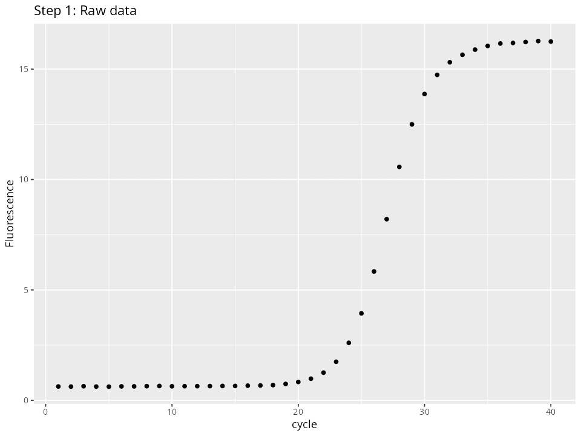

# aneuQPCR
aneuQPCR is a collection of R functions developed for personal use to support the quantification of bulk aneuploidies using qPCR data. Although not structured as a formal R package, this repository can be helpful for anyone who needs to:

- Estimate PCR amplification efficiency on a per-reaction basis and without the need for standard curves.

- Infer the initial amount of a target DNA template in each reaction without relying on Ct values and taking amplification efficiency into account. 

Here is a graphical representation of how it works:


# Usage
The estimation of PCR amplification efficiency and extrapolation of initial target DNA amounts are done by with the `fit_model_LL5()` function. This function expects a `qPCRobj` object, which can be created with `create_qPCRobj()`. As input, you only need a matrix where columns are PCR reactions (wells in a PCR plate), rows are the cycle number, and values are the fluorescence signal captured in each cycle. 
```r
example <- read.table("example.tsv", sep = "\t", header = TRUE)
head(example[,1:10])
```
```
         A1        A2        A3        A4        A5        A6        A7        A8        A9       A10
1 0.5239000 0.6125121 0.5701215 0.5228364 0.6169507 0.5541717 0.5172233 0.6213536 0.5961946 0.5534271
2 0.5238418 0.6167268 0.5617964 0.5227783 0.6168821 0.5541101 0.5171658 0.6212846 0.6002396 0.5491089
3 0.5240165 0.6255011 0.5661160 0.5269753 0.6210436 0.5621573 0.5173383 0.6295111 0.6045525 0.5663244
4 0.5156322 0.6219083 0.5708830 0.5154804 0.6098546 0.5549119 0.5139606 0.6342259 0.5928738 0.5584291
5 0.5202318 0.6220468 0.5627346 0.5196232 0.6139513 0.5550355 0.5140751 0.6263371 0.5888877 0.5628172
6 0.5247166 0.6263367 0.5710101 0.5236513 0.6258342 0.5629084 0.5061662 0.6423971 0.5930059 0.5585534
```
```r
qPCRobj <- create_qPCRobj(amp_curves = example)
```
If your matrix also contains the values for a melting curve at the end of the PCR program, you can trim the melting curve part by seting `melting_curve` to true and specifying the cycle number where the PCR ends with `ncycles`. 
```r
qPCRobj <- create_qPCRobj(amp_curves = example, melting_cruve = TRUE, ncycles = 40)
```
Once created, you can use `fit_model_LL5()` to fit the LL5 model and calculate the PCR efficiency and initial target DNA amount in each PCR reaction:
```r
qPCRobj <- fit_model_LL5(qPCRobj)
```
The model is stored in qPCR$models$LL5. You can visualize a model with `plot_model()`. You can either visualize the model in its log2 scale or in the original scale by setting the `scale` argument:
```r
p1 <- plot_model(qPCRobj$models$LL5$F1)
p2 <- plot_model(qPCRobj$models$LL5$F1, scale = "original")
cowplot::plot_grid(p1, p2, nrow = 1)
```


To calculate Ct values, you can use the `calc_Cts()` function.
```r
qPCRobj <- calc_Cts(qPCRobj, threshold = 1)
```
You can visualize how the threshold is placed with `plot_amps()` 
```r
plot_amps(qPCRobj, threshold_line = 1)
```

Currently `calc_Cts` requires setting `threshold` manually. Automatic threshold detection is to be implemented in the future.

All the calculations are stored in qPCRobj$metadata$well_meta
```r
qPCRobj$metadata$well_meta[24:36,]
```
```
    well LL5_model_Rsquared linear_part_lm_Rsquared efficiency extrapolated_start inflection_point start_linear_part end_linear_part  Ct_value
B12  B12          0.9408438                      NA         NA                 NA        0.3206063                 1               5  1.000048
C1    C1          0.9999380               0.9974792   1.459941       0.0006803313       23.6608132                20              26 18.738223
C2    C2          0.9999207               0.9975602   1.459445       0.0006229751       23.8533923                20              26 19.144758
C3    C3          0.9999272               0.9972397   1.456738       0.0006893217       23.7870190                20              26 18.821323
C4    C4          0.9999333               0.9995111   1.516450       0.0004062539       22.8448897                20              25 18.185055
C5    C5          0.9999332               0.9995886   1.516904       0.0004041533       22.9773211                20              25 18.136330
C6    C6          0.9999424               0.9994633   1.515414       0.0004090785       22.8907127                20              25 18.105813
C7    C7          0.9999009               0.9987441   1.371012       0.0012978475       26.5826881                22              29 20.294592
C8    C8          0.9998731               0.9995272   1.374763       0.0009981954       27.3176750                23              30 20.949894
C9    C9          0.9998740               0.9993064   1.366220       0.0012240244       27.5195416                23              30 20.351869
C10  C10          0.9999014               0.9995638   1.469715       0.0003768329       25.2392291                22              28 19.436132
C11  C11          0.9998829               0.9994462   1.468247       0.0003513653       25.4448093                22              28 19.788840
C12  C12          0.9999191               0.9993152   1.471679       0.0003239109       25.4002639                22              28 20.041160
```
You can the easily export this dataframe to an excel file with `xlsx`
xlsx::write.xlsx(qPCRobj$metadata$well_meta, file = "example_output.xlsx", row.names = FALSE)
