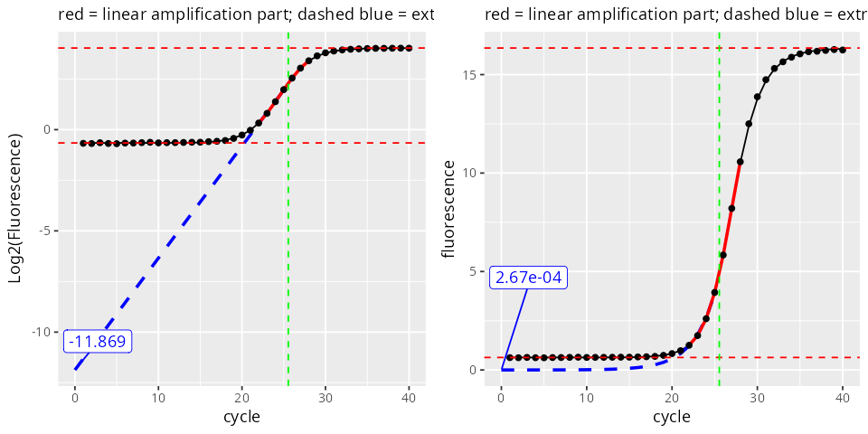

# aneuQPCR


aneuQPCR is a collection of R functions developed for the quantification of DNA using qPCR data. This project can be helpful for anyone who needs to:

- Determine PCR amplification efficiency on a per-reaction basis and without the need for standard curves.

- Estimate original DNA quantification in each reaction without relying on Ct values and taking amplification efficiency into account. 

Although originally developed with aneuploidy detection in mind, the functions are applicable to any qPCR dataset. They can also be useful in other contexts where precise quantification matters, such as gene expression analysis, copy number variation studies, and general molecular diagnostics.

Here is a graphical representation of how it works:

<p align="center">
  
</p>

# Installation
1) Download the repository by clicking the green `<> Code` buttom and `download Zip`.
2) Extract the zip file anywhere you prefer.
3) Alternatively, you can clone the repository via terminal if you have Git installed:
```sh
git clone git@github.com:gabrielnegreira/aneuQPCR.git
```
4) In R, set working directory to the location of the extracted folder:
```r
setwd("path/to/aneuQPCR")
```
5) Source the aneuQPCR functions
 ```r
source("aneuQPCR_functions.R")
```
# Usage
The estimation of PCR amplification efficiency and extrapolation of initial DNA amounts are done with the `fit_model_LL5()` function. This function expects a `qPCRobj` object, which can be created with `create_qPCRobj()`. As input, you only need a matrix where columns are PCR reactions (wells in a PCR plate), rows are the cycle number, and values are the fluorescence signal captured in each cycle. An example input file is provided as `example.tsv`. 

### 1) Import the matrix with the amplification curves.
```r
example <- read.table("example.tsv", sep = "\t", header = TRUE)
head(example[,1:10])
```
```
         A1        A2        A3        A4        A5        A6        A7        A8        A9       A10
1 0.5239000 0.6125121 0.5701215 0.5228364 0.6169507 0.5541717 0.5172233 0.6213536 0.5961946 0.5534271
2 0.5238418 0.6167268 0.5617964 0.5227783 0.6168821 0.5541101 0.5171658 0.6212846 0.6002396 0.5491089
3 0.5240165 0.6255011 0.5661160 0.5269753 0.6210436 0.5621573 0.5173383 0.6295111 0.6045525 0.5663244
4 0.5156322 0.6219083 0.5708830 0.5154804 0.6098546 0.5549119 0.5139606 0.6342259 0.5928738 0.5584291
5 0.5202318 0.6220468 0.5627346 0.5196232 0.6139513 0.5550355 0.5140751 0.6263371 0.5888877 0.5628172
6 0.5247166 0.6263367 0.5710101 0.5236513 0.6258342 0.5629084 0.5061662 0.6423971 0.5930059 0.5585534
```
### 2) create the qPCR object.
```r
qPCRobj <- create_qPCRobj(amp_curves = example)
```
If your matrix also contains the values for a melting curve at the end of the PCR program, you can trim the melting curve part by seting `melting_curve` to true and specifying the cycle number where the PCR ends with `ncycles`. 
```r
qPCRobj <- create_qPCRobj(amp_curves = example, melting_curve = TRUE, ncycles = 40)
```

### 3) Calculate efficiency and infer initial DNA amount.
   
Once created, you can use `fit_model_LL5()` to fit the LL5 model and calculate the PCR efficiency and initial DNA amount in each PCR reaction:
```r
qPCRobj <- fit_model_LL5(qPCRobj)
```
The model is stored in qPCR$models$LL5. You can visualize a model with `plot_model()`. You can either visualize the model in its log2 scale or in the original scale by setting the `scale` argument:
```r
p1 <- plot_model(qPCRobj$models$LL5$F1)
p2 <- plot_model(qPCRobj$models$LL5$F1, scale = "original")
cowplot::plot_grid(p1, p2, nrow = 1)
```
<p align="center">
  
</p>

### 4) (Optional) Calculate Ct values.

To calculate Ct values, you can use the `calc_Cts()` function.
```r
qPCRobj <- calc_Cts(qPCRobj, threshold = 1)
```
You can visualize how the threshold is placed with `plot_amps()` 
```r
plot_amps(qPCRobj, threshold_line = 1, scale = "log2")
```
<p align="center">
  
</p>

Currently `calc_Cts` requires setting `threshold` manually. Automatic threshold detection is to be implemented in the future.

### 5) Export results.
All the calculations are stored in qPCRobj$metadata$well_meta
```r
qPCRobj$metadata$well_meta[24:36,]
```
```
    well LL5_model_Rsquared linear_part_lm_Rsquared efficiency extrapolated_start inflection_point start_linear_part end_linear_part  Ct_value
B12  B12          0.9408438                      NA         NA                 NA        0.3206063                 1               5  1.000048
C1    C1          0.9999380               0.9974792   1.459941       0.0006803313       23.6608132                20              26 18.738223
C2    C2          0.9999207               0.9975602   1.459445       0.0006229751       23.8533923                20              26 19.144758
C3    C3          0.9999272               0.9972397   1.456738       0.0006893217       23.7870190                20              26 18.821323
C4    C4          0.9999333               0.9995111   1.516450       0.0004062539       22.8448897                20              25 18.185055
C5    C5          0.9999332               0.9995886   1.516904       0.0004041533       22.9773211                20              25 18.136330
C6    C6          0.9999424               0.9994633   1.515414       0.0004090785       22.8907127                20              25 18.105813
C7    C7          0.9999009               0.9987441   1.371012       0.0012978475       26.5826881                22              29 20.294592
C8    C8          0.9998731               0.9995272   1.374763       0.0009981954       27.3176750                23              30 20.949894
C9    C9          0.9998740               0.9993064   1.366220       0.0012240244       27.5195416                23              30 20.351869
C10  C10          0.9999014               0.9995638   1.469715       0.0003768329       25.2392291                22              28 19.436132
C11  C11          0.9998829               0.9994462   1.468247       0.0003513653       25.4448093                22              28 19.788840
C12  C12          0.9999191               0.9993152   1.471679       0.0003239109       25.4002639                22              28 20.041160
```
You can then easily export this dataframe to an excel file with the `xlsx` package
```r
xlsx::write.xlsx(qPCRobj$metadata$well_meta, file = "example_output.xlsx", row.names = FALSE)
```

# Calculating relative quantities
To estimate relative quantification between a target and a reference sample, we can use two approaches:

1st Option: Using extrapolated amounts:

$$CN_T = \left(\frac{Start_T}{Start_R}\right) \times CN_R$$

Where:
  - $CN_T$ is the **copy number** of the **target** sample.
  - $Start_T$ is the extrapolated **start** amount of the **target** sample.
  - $Start_R$ is the extrapolated **start** amount of the **reference** sample.
  - $CN_R$ is the **copy number** of the **reference** sample.

2nd option: Using Ct values with efficiency compensation:

$$CN_T = \left(\frac{Ef_R^{Ct_R}}{Ef_T^{Ct_T}}\right) \times CN_R$$

Where:
  - $CN_T$ is the **copy number** of the **target** sample.
  - $Ef_R$ is the **efficiency** of the **reference** sample.
  - $Ct_R$ is the **Ct** value of the **reference** sample.
  - $Ef_T$ is the **efficiency** of the **target** sample.
  - $Ct_T$ is the **Ct** value of the **target** sample.
  - $CN_R$ is the **copy number** of the **reference** sample.

Both approaches should yield similar results. Note that option 1 does not require the determination of Ct values. 

# Acknowledgements
The method for determination of amplification efficiency and inference of initial amount of target DNA is based on approach described in:

- Christian Ramakers, Jan M Ruijter, Ronald H.Lekanne Deprez, Antoon F.M Moorman,
*Assumption-free analysis of quantitative real-time polymerase chain reaction (PCR) data*,
Neuroscience Letters,
Volume 339, Issue 1,
2003,
Pages 62-66,
ISSN 0304-3940,
[https://doi.org/10.1016/S0304-3940(02)01423-4](https://www.sciencedirect.com/science/article/pii/S0304394002014234)

**Packages:**
- [drc](https://cran.r-project.org/web/packages/drc/) for the LL5 modeling
- [tidyverse](https://www.tidyverse.org/) for general coding and plots.

# 📬 Contact & Contributions

If you have questions, suggestions, or want to contribute, feel free to:

- 🐛 Open an [issue](https://github.com/gabrielnegreira/aneuQPCR/issues)  
- 🔧 Submit a pull request  
- 🧑‍💻 Contact me via [GitHub](https://github.com/gabrielnegreira)  
- 📧 Email me at: **gnegreira_github@proton.me**
